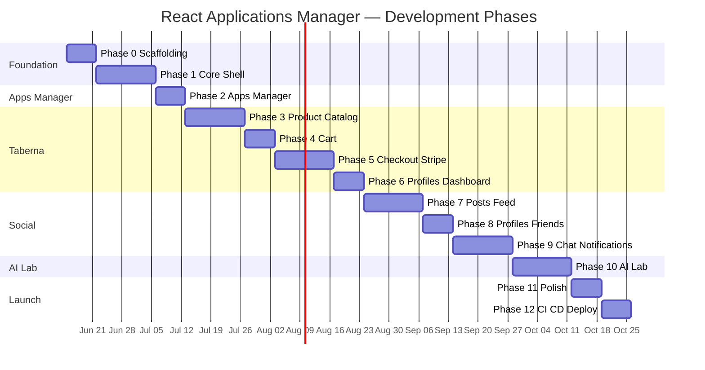

# React Applications Manager — Frontend Development Plan

## Full React + TypeScript rewrite of the Vue Applications Manager monorepo SPA

---

## 0. Context & Starting Point

### Existing Vue Frontend Summary

The current application (`test-applications-manager-vue`) is a **Vue 3.5** single-page app with **four embedded sub-applications** sharing one Django REST API backend:

| Sub-app                | Route prefix                   | Purpose                                                    |
| ---------------------- | ------------------------------ | ---------------------------------------------------------- |
| **Apps Manager**       | `/`, `/apps_manager/*`         | Portfolio launcher — card grid of projects                 |
| **Taberna eCommerce**  | `/taberna`, `/taberna-store/*` | Product catalog, cart, Stripe checkout, user dashboard     |
| **Social Network DRF** | `/social/*`                    | Posts feed, profiles, friends, chat, notifications         |
| **AI Lab**             | `/ai-lab/*`                    | AI chat, image/voice generation, OpenAI Realtime WebSocket |

**Current stack:** Vue 3, Vue Router 5, Vuex 4, Vuetify 4, Axios, Vuelidate, CryptoJS, Vite 8, Vitest, Firebase Hosting.

**Reference implementation:** [README.md](../README.md), per-app READMEs under `src/apps/*/README.md`, and completed refactor index [docs/frontend-refactor/README.md](./frontend-refactor/README.md).

### What This Plan Covers

A **feature-parity React + TypeScript rewrite** in a **new repository** (recommended name: `test-applications-manager-react`) that:

- Uses the **same Django REST API** on AWS — **no backend changes**
- Preserves **all user-visible URLs** (`/taberna/cart`, `/social/chat`, etc.)
- Replicates **all four sub-applications** with equivalent UX
- Deploys to **Firebase Hosting** (same or parallel project)
- Matches Vue app behaviour for JWT auth, cart merge on login, Stripe modes, WebSockets

### Vue → React Reference Mapping

| Vue (current)                 | React (target)                                                                    |
| ----------------------------- | --------------------------------------------------------------------------------- |
| Vue SFC (`.vue`)              | Function components (`.tsx`) + colocated `*.module.css` (or MUI `sx`)             |
| Vue Router + `meta.layout`    | React Router v7 (`createBrowserRouter`) + nested **layout routes**                |
| Vuex namespaced modules       | **TanStack Query** for server state + **Zustand** stores for client/session state |
| Axios + interceptors          | **Axios** instance + request/response interceptors (kept as-is)                   |
| Vuelidate                     | **React Hook Form** + **Zod** schema resolvers                                    |
| Vuetify (`v-app`, `v-btn`, …) | **MUI (Material UI) v7** components (`@mui/material` + `@mui/icons-material`)     |
| `import.meta.env.VITE_*`      | `import.meta.env.VITE_*` (**identical** — Vite on both sides)                     |
| Vitest + `@vue/test-utils`    | **Vitest** + **React Testing Library** + **MSW**                                  |
| Composables (`useX`)          | Custom hooks (`useX`)                                                             |
| Dynamic layout in `App.vue`   | Parent layout route elements with `<Outlet />`                                    |

### Why this stack (best practice, 2026)

| Concern      | Choice                                   | Rationale                                                                                                                                                                                                                                                                                     |
| ------------ | ---------------------------------------- | --------------------------------------------------------------------------------------------------------------------------------------------------------------------------------------------------------------------------------------------------------------------------------------------- |
| UI library   | **MUI (Material UI) v7**                 | Most widely-adopted, production-ready React component library; implements Material Design (direct parallel to Vuetify / Angular Material); ships **default styles + theme tokens** so we customize minimally; first-class light/dark via `colorSchemes` + CSS variables; React 19 compatible. |
| Server state | **TanStack Query v5**                    | Caching, retries, background refetch, request dedup — replaces most Vuex fetch/loading boilerplate.                                                                                                                                                                                           |
| Client state | **Zustand v5**                           | Minimal, hook-based global store for tokens, cart, alerts, theme — replaces Vuex modules that hold _client_ (not server) state.                                                                                                                                                               |
| Routing      | **React Router v7** (library/data mode)  | Standard SPA router; nested routes replace Vue's dynamic layout switch.                                                                                                                                                                                                                       |
| HTTP         | **Axios**                                | Direct port of `axiosInterceptors.js` (JWT attach + 401 refresh).                                                                                                                                                                                                                             |
| Forms        | **React Hook Form + Zod**                | Performant uncontrolled forms + typed schema validation (Vuelidate parity).                                                                                                                                                                                                                   |
| Tests        | **Vitest + React Testing Library + MSW** | Same runner as Vue; RTL is the React standard; MSW mocks the Django API.                                                                                                                                                                                                                      |

> **UI framework decision (explicit):** MUI v7 is chosen as the _most current, most actual_ React component library that lets us **use default library styling with minimal customization** — exactly matching the Vuetify (Vue) and Angular Material (Angular) approach. We do **not** pick a utility/headless kit (Tailwind, shadcn/ui, Radix) because those require building/customizing styles from scratch, which contradicts the "default styles" requirement.

### Backend Dependency (all phases)

> **No new backend work is required.** The Django REST API, WebSocket endpoints, and Stripe webhooks already exist and power the Vue app today. Each React phase lists which **existing** API surface must be reachable for integration testing.

**Backend docs:**

- [Taberna Backend](https://karnaukh-webdev.com/category/django/taberna-drf-ecommerce/)
- [Social Network Backend](https://karnaukh-webdev.com/category/django/social-network-drf/)
- [AI Lab Backend](https://karnaukh-webdev.com/category/django/ai-lab-back-end/)

---

## 1. Project Structure

### 1.1 Recommended Repository Layout

```
react-test-manager/
├── package.json
├── tsconfig.json
├── tsconfig.app.json
├── vite.config.ts
├── vitest.config.ts               # or test block inside vite.config.ts
├── eslint.config.js               # flat config
├── firebase.json
├── .github/workflows/firebase-hosting-merge.yml
├── .env.example
├── .nvmrc
├── Makefile
├── README.md
├── index.html
├── public/                        # static assets served at root (hero images, favicon)
├── docs/
│   └── react-frontend-development-plan.md   # copy or link to this plan
└── src/
    ├── main.tsx                   # createRoot + <RouterProvider> + providers
    ├── App.tsx                    # (optional) top-level shell if not fully route-driven
    ├── vite-env.d.ts              # ImportMetaEnv typing for VITE_* vars
    │
    ├── app/                       # app-wide wiring (was main.js + App.vue)
    │   ├── providers.tsx          # QueryClientProvider + ThemeProvider + CssBaseline + Alert host
    │   ├── query-client.ts        # configured QueryClient (staleTime, retry)
    │   └── theme.ts               # MUI createTheme (light/dark colorSchemes, 4px radius, Roboto)
    │
    ├── router/
    │   ├── index.tsx              # createBrowserRouter, spreads feature route arrays
    │   └── require-auth.tsx       # RequireAuth wrapper (mirrors guards.js)
    │
    ├── core/                      # singletons: http, auth, cross-cutting services
    │   ├── auth/
    │   │   ├── auth.store.ts       # Zustand: tokens, isAuthenticated, activeApp
    │   │   ├── auth.api.ts         # login/refresh/logout HTTP (JWT per app)
    │   │   ├── auth-register.api.ts# legacy token signup endpoints
    │   │   ├── auth.endpoints.ts   # per-app obtain/refresh/register URL resolver
    │   │   └── auth.types.ts
    │   ├── http/
    │   │   ├── axios.ts            # axios instance (baseURL from env)
    │   │   └── interceptors.ts     # JWT attach + 401 refresh (port of axiosInterceptors.js)
    │   └── alert/
    │       └── alert.store.ts      # Zustand: global snackbar queue
    │
    ├── shared/
    │   ├── ui/
    │   │   ├── AppMessage.tsx      # global MUI Snackbar/Alert bound to alert.store
    │   │   ├── AuthPageShell.tsx   # centers auth/status pages
    │   │   └── LoadingOverlay.tsx  # global progress
    │   ├── components/
    │   │   ├── AuthLoginForm.tsx
    │   │   └── AuthSignupForm.tsx
    │   ├── hooks/                  # useDebounce, useMediaQuery wrappers, etc.
    │   ├── utils/
    │   │   ├── crypto.ts           # CryptoJS AES helpers (port of cryptoUtils.js)
    │   │   ├── domain.ts
    │   │   └── error.ts
    │   └── validation/
    │       └── auth.schemas.ts     # Zod schemas (Vuelidate parity)
    │
    └── features/                   # mirrors src/apps/* in Vue
        ├── apps-manager/
        │   ├── apps-manager.routes.tsx
        │   ├── layouts/MainAppsManagerLayout.tsx
        │   ├── pages/             # HomePage, SearchPage, NotFoundPage
        │   ├── components/        # Navbar, Footer, AppCard
        │   ├── api/              # reactApps.ts (pure HTTP)
        │   └── hooks/            # useApps, useAppSearch (React Query)
        │
        ├── taberna/
        │   ├── taberna.routes.tsx
        │   ├── layouts/MainTabernaLayout.tsx
        │   ├── product/          # api/ hooks/ components/ pages/
        │   ├── cart/             # api/ store/ components/ pages/ (cart.store.ts = Zustand)
        │   ├── orders/           # checkout, success, failed + stripe.service.ts
        │   └── profiles/         # login, signup, dashboard
        │
        ├── social/
        │   ├── social.routes.tsx
        │   ├── layouts/MainSocialLayout.tsx
        │   ├── posts/
        │   ├── profiles/
        │   ├── chat/             # + useChatSocket hook
        │   └── notifications/    # + useNotificationSocket hook
        │
        └── ai-lab/
            ├── ai-lab.routes.tsx
            ├── layouts/MainAiLabLayout.tsx
            ├── pages/
            ├── components/       # PromptForm, RealtimeChat
            ├── api/
            └── hooks/            # useRealtimeSocket
```

### 1.2 Component & Module Strategy

Use **function components + hooks** only (no class components). Split code by **feature folder** (colocation), and lazy-load each feature route group with `React.lazy` + route-level `lazy` so each sub-app is a separate bundle chunk.

| Feature area | Route prefix               | Layout component        |
| ------------ | -------------------------- | ----------------------- |
| Apps Manager | `''` (root)                | `MainAppsManagerLayout` |
| Taberna      | `taberna`, `taberna-store` | `MainTabernaLayout`     |
| Social       | `social`                   | `MainSocialLayout`      |
| AI Lab       | `ai-lab`                   | `MainAiLabLayout`       |

### 1.3 Integration Points (React bootstrap)

| Integration Point    | Action                                                                                                 |
| -------------------- | ------------------------------------------------------------------------------------------------------ |
| `main.tsx`           | `createRoot(...).render(<Providers><RouterProvider router={router} /></Providers>)`                    |
| `app/providers.tsx`  | Wrap tree in `QueryClientProvider`, MUI `ThemeProvider` + `CssBaseline`, and mount global `AppMessage` |
| `core/http/axios.ts` | Set `baseURL` from `import.meta.env.VITE_REMOTE_HOST`; attach interceptors                             |
| `vite-env.d.ts`      | Type all `VITE_*` env vars via `ImportMetaEnv`                                                         |
| `router/index.tsx`   | Spread route arrays from each feature's `*.routes.tsx`                                                 |
| `Main*Layout`        | Host navbar, footer, `<Outlet />`, app-specific init (e.g. notification WebSocket on Social layout)    |
| `firebase.json`      | SPA rewrite rules — same as Vue (`**` → `/index.html`)                                                 |

---

## 2. Route Configuration

### 2.1 Route Parity Matrix (must match Vue exactly)

#### Apps Manager

| Path                   | Component    | Auth | Layout                  |
| ---------------------- | ------------ | ---- | ----------------------- |
| `/`                    | HomePage     | No   | `MainAppsManagerLayout` |
| `/apps_manager/search` | SearchPage   | No   | `MainAppsManagerLayout` |
| `/*` (catch-all)       | NotFoundPage | No   | `MainAppsManagerLayout` |

#### Taberna

| Path                                                   | Component          | Auth (`authJWT`) | Layout              |
| ------------------------------------------------------ | ------------------ | ---------------- | ------------------- |
| `/taberna`                                             | ProductHomePage    | No               | `MainTabernaLayout` |
| `/taberna/signup`                                      | SignupPage         | No               | `MainTabernaLayout` |
| `/taberna/login`                                       | LoginPage          | No               | `MainTabernaLayout` |
| `/taberna/dashboard`                                   | DashboardPage      | **Yes**          | `MainTabernaLayout` |
| `/taberna-store/category/:category_slug`               | CategoryDetailPage | No               | `MainTabernaLayout` |
| `/taberna-store/category/:category_slug/:product_slug` | ProductDetailPage  | No               | `MainTabernaLayout` |
| `/taberna/search`                                      | SearchPage         | No               | `MainTabernaLayout` |
| `/taberna/cart`                                        | CartPage           | No               | `MainTabernaLayout` |
| `/taberna/cart/checkout`                               | CheckoutPage       | **Yes**          | `MainTabernaLayout` |
| `/taberna/cart/success`                                | SuccessPage        | No               | `MainTabernaLayout` |
| `/taberna/cart/failed`                                 | FailedPage         | No               | `MainTabernaLayout` |

#### Social

| Path                            | Component         | Auth    | Layout             |
| ------------------------------- | ----------------- | ------- | ------------------ |
| `/social/home`                  | FeedHomePage      | No      | `MainSocialLayout` |
| `/social/profile/edit`          | EditProfilePage   | **Yes** | `MainSocialLayout` |
| `/social/profile/:slug`         | ProfilePage       | No      | `MainSocialLayout` |
| `/social/profile/:slug/friends` | FriendsPage       | **Yes** | `MainSocialLayout` |
| `/social/:id`                   | PostDetailPage    | No      | `MainSocialLayout` |
| `/social/trends/:id`            | TrendPage         | No      | `MainSocialLayout` |
| `/social/chat`                  | ChatPage          | **Yes** | `MainSocialLayout` |
| `/social/notifications`         | NotificationsPage | **Yes** | `MainSocialLayout` |
| `/social/search`                | SearchPage        | No      | `MainSocialLayout` |
| `/social/signup`                | SignupPage        | No      | `MainSocialLayout` |
| `/social/login`                 | LoginPage         | No      | `MainSocialLayout` |
| `/social/edit/password`         | EditPasswordPage  | **Yes** | `MainSocialLayout` |

#### AI Lab

| Path                      | Component               | Layout            |
| ------------------------- | ----------------------- | ----------------- |
| `/ai-lab`                 | AiHomePage (Funny Chat) | `MainAiLabLayout` |
| `/ai-lab/image-generator` | ImageGeneratorPage      | `MainAiLabLayout` |
| `/ai-lab/voice-generator` | VoiceGeneratorPage      | `MainAiLabLayout` |
| `/ai-lab/realtime-chat`   | RealtimeChatPage        | `MainAiLabLayout` |

### 2.2 Route Guards

Mirror Vue `meta.authJWT` with a `RequireAuth` wrapper element (React Router has no `meta`; use a wrapper component or route `loader`):

```tsx
// router/require-auth.tsx
export function RequireAuth({
  app,
  children,
}: {
  app: AppName
  children: ReactNode
}) {
  const isAuthenticated = useAuthStore((s) => s.isAuthenticated())
  const location = useLocation()
  if (!isAuthenticated) {
    return <Navigate to={getLoginRoute(app, location.pathname)} replace />
  }
  return <>{children}</>
}
```

```tsx
// taberna.routes.tsx (excerpt)
{
  path: 'taberna/cart/checkout',
  element: (
    <RequireAuth app="taberna">
      <CheckoutPage />
    </RequireAuth>
  ),
}
```

| Guard behaviour                        | Logic (same as Vue `guards.js`)                       |
| -------------------------------------- | ----------------------------------------------------- |
| Protected route, no valid access token | redirect to login route for that app                  |
| Taberna login redirect                 | `/taberna/login?redirect=<encoded-path>&message=auth` |
| Social login redirect                  | `/social/login?message=auth`                          |
| Default (other apps)                   | `/`                                                   |

### 2.3 Layout Routing Pattern

Replace Vue's dynamic `<component :is="layoutComponent">` with **nested layout routes** and `<Outlet />`:

```tsx
{
  element: <MainTabernaLayout />,          // renders navbar + <Outlet/> + footer + <AppMessage/>
  children: [
    { path: 'taberna', element: <ProductHomePage /> },
    // ...rest of Taberna routes
  ],
}
```

Each `Main*Layout` template: navbar + `<Outlet />` + footer + global `AppMessage`.

### 2.4 Route registration order (critical)

In `router/index.tsx`, **Apps Manager routes must be registered first**.

Several feature groups use root-relative paths under a layout element. React Router matches by specificity, but the **catch-all** (`path: '*'`) and the root (`/`) belong to Apps Manager and must not be shadowed. Register Apps Manager first and keep its `*` catch-all **last overall**:

```tsx
export const router = createBrowserRouter([
  ...appsManagerRoutes, // owns `/` and `/apps_manager/*`
  ...tabernaRoutes,
  ...socialRoutes,
  ...aiLabRoutes,
  ...appsManagerNotFoundRoute, // catch-all `*` last
])
```

---

## 3. State Management

### 3.1 Vuex → React Mapping

React best practice separates **server state** (owned by TanStack Query) from **client state** (owned by Zustand). Most Vuex modules map to _both_: HTTP + cache → Query hooks; local/session flags → a small Zustand slice.

| Vue Vuex module          | React equivalent                                                   | Scope                      |
| ------------------------ | ------------------------------------------------------------------ | -------------------------- |
| `authJWT`                | `auth.store.ts` (Zustand) + `auth.api.ts`                          | Core                       |
| `authToken`              | `auth-register.api.ts` (+ mutation hook)                           | Core (signup registration) |
| `alert`                  | `alert.store.ts` (Zustand) → `AppMessage` (MUI Snackbar)           | Core                       |
| Root `isLoading`         | TanStack Query `isPending` states + `LoadingOverlay`               | Core                       |
| `tabernaCartData`        | `cart.store.ts` (Zustand) + `useCart` Query/mutations              | Taberna                    |
| `tabernaOrdersData`      | `useOrders` mutations + `stripe.service.ts`                        | Taberna                    |
| `tabernaProductData`     | `useProducts`, `useCategories` (Query)                             | Taberna                    |
| `tabernaProfileData`     | `auth.store.ts` + `useOrderHistory` (Query)                        | Taberna                    |
| `socialPostData`         | `usePostsFeed` (infinite Query), post mutations                    | Social                     |
| `socialProfileData`      | `useProfile`, `useFriends` (Query) + edit mutations                | Social                     |
| `socialChatData`         | `useConversations`/`useMessages` (Query) + `useChatSocket`         | Social                     |
| `socialNotificationData` | `useNotifications` (Query) + `useNotificationSocket` + badge store | Social                     |
| `aiLabChatData`          | `ai-lab` mutations + `useRealtimeSocket`                           | AI Lab                     |

### 3.2 Recommended Approach

| Data type                                                                                                  | Tool                | Why                                                                                                    |
| ---------------------------------------------------------------------------------------------------------- | ------------------- | ------------------------------------------------------------------------------------------------------ |
| **Server data** (products, posts, orders, profiles, chat history, notifications)                           | **TanStack Query**  | Caching, dedup, pagination/infinite scroll, background refetch, retry — removes most Vuex boilerplate. |
| **Client/session state** (JWT tokens, `isAuthenticated`, active app, cart local state, alert queue, theme) | **Zustand**         | Tiny hook-based stores; selective subscriptions avoid re-render storms.                                |
| **Form state**                                                                                             | **React Hook Form** | Local to the form; not global.                                                                         |

**Recommendation:** Default to **Query for server + Zustand for client**. Do **not** introduce Redux Toolkit unless a future requirement demands strict Redux DevTools time-travel (not needed for parity).

### 3.3 Persistence Rules (parity with Vue)

| Data                | Storage                                 | Notes                                                     |
| ------------------- | --------------------------------------- | --------------------------------------------------------- |
| JWT access/refresh  | `localStorage` keys `access`, `refresh` | Same keys for cross-app compatibility during migration    |
| Active app          | `localStorage` key `active_app`         | Values: `taberna`, `social`, etc.                         |
| Anonymous cart ID   | `localStorage` `cartId`                 | Taberna cart merge on login                               |
| Social user profile | `localStorage` encrypted via CryptoJS   | Key from `VITE_ENCRIPTION_KEY`                            |
| Theme (light/dark)  | `localStorage` (MUI `colorScheme`)      | MUI persists via `InitColorSchemeScript`/`useColorScheme` |
| Checkout form state | In-memory only                          | Do not persist billing data                               |

> Zustand `persist` middleware can back the auth/cart/theme slices with `localStorage` using the **exact keys above** during the migration window.

---

## 4. HTTP & Authentication Layer

### 4.1 Axios Interceptors (direct port of `axiosInterceptors.js`)

Keep Axios (not `fetch`) so the JWT attach + 401 refresh logic ports 1:1. TanStack Query calls these Axios functions inside `queryFn`/`mutationFn`.

| Request interceptor | Attach `Authorization: Bearer <accessToken>` from `auth.store` |
| Response interceptor | On 401 (not the refresh/obtain URL, not already retried): call `refreshToken()`, retry original request once; on refresh failure → logout + redirect |

### 4.2 JWT Endpoints per App

| App           | Obtain URL                                |
| ------------- | ----------------------------------------- |
| Default       | `POST /api/v1/token/`                     |
| Taberna       | `POST /taberna-profiles/api/v1/token/`    |
| Social        | `POST /api/social-profiles/api/v1/token/` |
| Refresh (all) | `POST /api/v1/token/refresh/`             |

### 4.3 Registration Endpoints

| App     | Register URL                           |
| ------- | -------------------------------------- |
| Taberna | `POST /taberna-profiles/api/register/` |
| Social  | `POST /api/social-profiles/register/`  |
| Default | `POST /api/v1/authusers/`              |

### 4.4 Environment Variables

Because both Vue and React use **Vite**, env var names are **identical** — this is a near 1:1 copy of `.env.example`. Type them in `vite-env.d.ts`.

| Variable                  | Purpose                                                                 |
| ------------------------- | ----------------------------------------------------------------------- |
| `VITE_REMOTE_HOST`        | API base URL                                                            |
| `VITE_ENCRIPTION_KEY`     | CryptoJS AES for social profile (note: original Vue spelling preserved) |
| `VITE_STRIPE_PUBLIC_KEY`  | Stripe.js publishable key                                               |
| `VITE_STRIPE_ACTION_TYPE` | `session` or `charge`                                                   |
| `NODE_VERSION` / `.nvmrc` | Node 22.x                                                               |

```ts
// vite-env.d.ts
interface ImportMetaEnv {
  readonly VITE_REMOTE_HOST: string
  readonly VITE_ENCRIPTION_KEY: string
  readonly VITE_STRIPE_PUBLIC_KEY: string
  readonly VITE_STRIPE_ACTION_TYPE: 'session' | 'charge'
}
```

---

## 5. API Service Layer

Pure HTTP functions in each feature's `api/*.ts` — no components, no React. TanStack Query hooks (`hooks/*.ts`) wrap them. Mirror Vue `src/apps/*/api/*.js`.

### 5.1 Apps Manager

| Method | Endpoint                     | Function            |
| ------ | ---------------------------- | ------------------- |
| GET    | `/api/v1/react-apps/`        | `fetchApps()`       |
| POST   | `/api/v1/react-apps/search/` | `searchApps(query)` |

> **Note:** The Vue reference app calls `/api/v1/vue-apps/` (and the Angular port uses `/api/v1/angular-apps/`). This React app uses `/api/v1/react-apps/` with the **same response shape**. Confirm the endpoint exists on the backend; if not, reuse `/api/v1/vue-apps/` until a React-specific collection is added.

### 5.2 Taberna — Products

| Method | Endpoint                                            |
| ------ | --------------------------------------------------- |
| GET    | `/taberna-store/api/v1/latest-products/`            |
| GET    | `/taberna-store/api/v1/products/:category_slug/`    |
| GET    | `/taberna-store/api/v1/products/:category/:product` |
| GET    | `/taberna-store/api/v1/product-categories/`         |
| POST   | `/taberna-store/api/v1/products/search/`            |

### 5.3 Taberna — Cart

| Method | Endpoint                                                     |
| ------ | ------------------------------------------------------------ |
| GET    | `/taberna-cart/api/cart/`                                    |
| POST   | `/taberna-cart/api/add-to-cart/:productId/`                  |
| DELETE | `/taberna-cart/api/cart-remove/:productId/:cartItemId/`      |
| DELETE | `/taberna-cart/api/cart-item-remove/:productId/:cartItemId/` |

### 5.4 Taberna — Orders & Profiles

| Method | Endpoint                                             |
| ------ | ---------------------------------------------------- |
| POST   | `/taberna-orders/api/v1/place_order_stripe_session/` |
| POST   | `/taberna-orders/api/v1/place_order_stripe_charge/`  |
| POST   | `/taberna-orders/api/v1/order_payment_success/`      |
| POST   | `/taberna-orders/api/v1/order_payment_failed/`       |
| GET    | `/taberna-profiles/api/v1/orders/`                   |

### 5.5 Social — Posts

| Method | Endpoint                           |
| ------ | ---------------------------------- |
| GET    | `/api/social-posts/`               |
| POST   | `/api/social-posts/create/`        |
| GET    | `/api/social-posts/:id/`           |
| POST   | `/api/social-posts/:id/comment/`   |
| POST   | `/api/social-posts/:id/like/`      |
| POST   | `/api/social-posts/:id/report/`    |
| DELETE | `/api/social-posts/:id/delete/`    |
| GET    | `/api/social-posts/profile/:slug/` |
| POST   | `/api/social-posts/search/`        |
| GET    | `/api/social-posts/trends/`        |
| GET    | `/api/social-posts/?trend=:id`     |

### 5.6 Social — Profiles

| Method | Endpoint                                      |
| ------ | --------------------------------------------- |
| GET    | `/api/social-profiles/me/`                    |
| POST   | `/api/social-profiles/editprofile/`           |
| POST   | `/api/social-profiles/editpassword/`          |
| GET    | `/api/social-profiles/friends/:slug/`         |
| POST   | `/api/social-profiles/friends/:slug/request/` |
| POST   | `/api/social-profiles/friends/:slug/:status/` |
| GET    | `/api/social-profiles/friends/suggested/`     |

### 5.7 Social — Chat & Notifications

| Method | Endpoint                                |
| ------ | --------------------------------------- |
| GET    | `/api/social-chat/`                     |
| GET    | `/api/social-chat/:id/`                 |
| POST   | `/api/social-chat/:id/send/`            |
| GET    | `/api/social-chat/:slug/get-or-create/` |
| GET    | `/api/social-notifications/`            |
| POST   | `/api/social-notifications/read/:id/`   |

### 5.8 AI Lab

| Method | Endpoint                        |
| ------ | ------------------------------- |
| POST   | `/ai-lab/`                      |
| POST   | `/ai-lab/image-generator/`      |
| POST   | `/ai-lab/voice-generator/`      |
| POST   | `/ai-lab/download-image/`       |
| POST   | `/ai-lab/upload-vision-images/` |
| DELETE | `/ai-lab/delete-vision-image/`  |
| POST   | `/ai-lab/realtime-token/`       |

> Full request/response contracts: see Vue per-app READMEs in `src/apps/*/README.md`.

---

## 6. WebSocket Integration

Wrap each socket in a **custom hook** that owns connect/disconnect via `useEffect` cleanup, and pushes updates into a Zustand slice or invalidates a Query cache.

### 6.1 Social Chat WebSocket

| Item       | Value                                                              |
| ---------- | ------------------------------------------------------------------ |
| URL        | `ws(s)://<remoteHost>/ws/social-chat/<conversationId>/<userId>/`   |
| Connect    | When user selects a conversation in Chat page                      |
| Disconnect | On conversation switch or leaving Chat route (`useEffect` cleanup) |
| Hook       | `useChatSocket(conversationId, userId)`                            |

### 6.2 Social Notification WebSocket

| Item       | Value                                                                   |
| ---------- | ----------------------------------------------------------------------- |
| URL        | `ws(s)://<remoteHost>/ws/notification/<userId>/`                        |
| Connect    | On login + `MainSocialLayout` mount when authenticated                  |
| On message | `queryClient.invalidateQueries(['notifications'])`, update unread badge |
| Disconnect | On logout / layout unmount                                              |

### 6.3 AI Lab OpenAI Realtime WebSocket

| Step | Action                                                              |
| ---- | ------------------------------------------------------------------- |
| 1    | `POST /ai-lab/realtime-token/` → ephemeral key                      |
| 2    | Open `wss://api.openai.com/v1/realtime` with subprotocol headers    |
| 3    | Send `conversation.item.create` + `response.create` on user message |
| 4    | Handle `response.done` → append transcript to chat history          |
| Init | `useRealtimeSocket` in `MainAiLabLayout` (mirrors Vue layout mount) |

---

## 7. Stripe Integration (Taberna)

Same dual-mode behaviour as Vue (`import.meta.env.VITE_STRIPE_ACTION_TYPE`). Use `@stripe/stripe-js` + `@stripe/react-stripe-js`.

### Session Mode (`session`)

1. Submit billing form → `POST /taberna-orders/api/v1/place_order_stripe_session/`
2. Redirect browser to Stripe `checkout_url`
3. Return to `/taberna/cart/success?session_id=...` or `/failed?session_id=...`
4. Confirm via `order_payment_success` / `order_payment_failed`

### Charge Mode (`charge`)

1. Wrap checkout in `<Elements stripe={stripePromise}>`, mount `CardElement`
2. `stripe.createToken(cardElement)` client-side
3. `POST /taberna-orders/api/v1/place_order_stripe_charge/` with token + billing data
4. Navigate to success/failed page

**React service:** `stripe.service.ts` — lazy-loads Stripe.js (`loadStripe`), encapsulates mode branching; `useCheckout` mutation hook calls it.

---

## 8. UI & Styling

### 8.0 UI foundation (mandatory)

**MUI (Material UI) v7 is the only UI library for this project.** When porting screens from the Vue app (Vuetify), do **not** recreate Vuetify markup or copy Vuetify-specific CSS. Map each Vuetify building block to the **closest MUI equivalent** and use **default MUI appearance** (theme tokens, stock component layout, minimal `sx`, no bespoke CSS unless unavoidable).

| Rule                        | Meaning                                                                                                             |
| --------------------------- | ------------------------------------------------------------------------------------------------------------------- |
| **Component-for-component** | Vuetify button → `Button`; Vuetify card → `Card`; Vuetify grid → MUI `Grid` (v2) or CSS `display: grid`             |
| **No Vuetify visual clone** | Do not hard-code Vuetify colors (`#ff4800`, theme bars, parallax overlays) to "match pixels"; rely on the MUI theme |
| **Minimal custom CSS**      | Prefer `sx` prop / theme tokens; global tokens live in `app/theme.ts` only                                          |
| **Reference**               | Vue file = **behaviour and structure**; React file = **MUI components** that fulfil the same UX                     |

**Example (Apps Manager):** Vue `v-app-bar` + `v-btn` + `v-card` → React `AppBar`/`Toolbar` + `Button` + `Card` with default styling.

### 8.1 Component Library (Vuetify → MUI)

| Vue (Vuetify)                              | MUI equivalent                                                         |
| ------------------------------------------ | ---------------------------------------------------------------------- |
| `v-app`                                    | root `Box` layout + `CssBaseline`                                      |
| `v-app-bar`                                | `AppBar` + `Toolbar`                                                   |
| `v-navigation-drawer`                      | `Drawer`                                                               |
| `v-btn`, `v-icon`                          | `Button` / `IconButton`, `@mui/icons-material` icons                   |
| `v-card`, `v-card-title`, `v-card-actions` | `Card`, `CardHeader`/`CardContent`, `CardActions`                      |
| `v-container`, `v-row`, `v-col`            | `Container`, `Grid` (v2) or `Box` flex / CSS grid (card grids: §8.1.2) |
| `v-img`                                    | `CardMedia` or `` with `object-fit`                               |
| `v-parallax`                               | `Box` with background image (static hero — no custom parallax JS)      |
| `v-dialog`                                 | `Dialog` + `DialogTitle`/`DialogContent`/`DialogActions`               |
| `v-menu`, `v-list`, `v-list-item`          | `Menu`/`MenuItem`, `List`/`ListItemButton`                             |
| `v-form`                                   | `<form>` + React Hook Form + `TextField`                               |
| `v-data-table`                             | `Table` (simple) or `@mui/x-data-grid` `DataGrid` (rich)               |
| `v-text-field`, `v-select`                 | `TextField`, `Select` / `TextField select`                             |
| `v-divider`                                | `Divider`                                                              |
| `v-snackbar` (AppMessage)                  | `Snackbar` + `Alert` via `alert.store`                                 |
| `v-progress-linear`, `v-progress-circular` | `LinearProgress`, `CircularProgress`                                   |
| `v-skeleton-loader`                        | `Skeleton`                                                             |
| Theme toggle                               | MUI `colorSchemes` + `useColorScheme()`                                |

### 8.1.1 Theme setup (mandatory)

Single source of truth in `app/theme.ts` using `createTheme` with **built-in light/dark color schemes** and **CSS theme variables**:

```ts
export const theme = createTheme({
  colorSchemes: { light: true, dark: true },
  cssVariables: { colorSchemeSelector: 'class' },
  typography: { fontFamily: 'Roboto, system-ui, sans-serif' },
  shape: { borderRadius: 4 }, // 4px corners (no pill buttons)
})
```

- Toggle via `const { mode, setMode } = useColorScheme()` in each navbar; MUI persists the choice.
- Add `<InitColorSchemeScript />` (or the SPA equivalent) to avoid a flash on load.
- Do **not** create per-feature theme files; extend tokens centrally.

### 8.1.2 Product & app cards (mandatory)

| Rule                       | Implementation                                                                                                                             |
| -------------------------- | ------------------------------------------------------------------------------------------------------------------------------------------ |
| **Images**                 | `aspectRatio: '3 / 2'` (Vue `v-img` 1.5) + `objectFit: 'cover'` + `width: 100%`. Never fixed height without `object-fit` — images stretch. |
| **Equal height in grid**   | Grid item stretches; `Card` uses `display: flex; flexDirection: 'column'; height: '100%'`; actions `mt: 'auto'`.                           |
| **Description truncation** | Taberna product cards: title `WebkitLineClamp: 1`, description `WebkitLineClamp: 2` with ellipsis.                                         |
| **Card actions**           | Prefer a flex `Box` with `justifyContent: 'space-between'` over relying on `CardActions` default spacing.                                  |
| **Grids**                  | MUI `Grid` (v2) responsive 1/2/3 cols; container `maxWidth: 1600`.                                                                         |

### 8.1.3 Layout shells & vertical centering (mandatory)

| Screen type                                                   | Pattern                                                                                                                                                    |
| ------------------------------------------------------------- | ---------------------------------------------------------------------------------------------------------------------------------------------------------- |
| **Feature layouts** (Taberna, Apps Manager)                   | Root `Box`: `minHeight: '100vh'; display: 'flex'; flexDirection: 'column'`; `<main>` (`Box component="main"`) `flex: 1`; footer pinned at bottom via flex. |
| **Auth / status pages** (login, signup, order success/failed) | Wrap in `AuthPageShell` — centers content vertically and horizontally.                                                                                     |
| **Product detail**                                            | Same centering as auth; inner `Card` gets `maxWidth`.                                                                                                      |
| **Auth form width**                                           | Set `maxWidth` on the **form wrapper** (`400px` login, `700px` signup), not on inner fields.                                                               |
| **Field spacing**                                             | `gap: 1.5` on a `Stack` wrapping the fields; extra `pt` under the card title.                                                                              |

### 8.1.4 Snackbars & alerts (mandatory)

`alert.store` (Zustand) → `AppMessage` → MUI `Snackbar` containing `Alert severity={error|success|warning|info}`.

- Use MUI `Alert` severities for coloring (built-in) — no manual container background hacks.
- Queue multiple alerts; auto-hide with `autoHideDuration`.

### 8.1.5 Dialogs & accessibility

| Rule               | Implementation                                                                                                               |
| ------------------ | ---------------------------------------------------------------------------------------------------------------------------- |
| **Search dialogs** | MUI `Dialog` with default rounded surface; `TransitionProps` optional.                                                       |
| **Focus**          | Rely on MUI `Dialog` focus trap; set initial focus with `autoFocus` on the primary field only where appropriate (a11y-safe). |
| **Labels**         | Every `TextField`/`IconButton` needs a `label`/`aria-label`.                                                                 |

### 8.2 Shared Auth Forms

Port `AuthLoginForm` and `AuthSignupForm` from `src/shared/auth/components/` as reusable React components using **React Hook Form + Zod**, matching Vuelidate rules.

- **Button row:** `Divider` then a flex `Box` with `justifyContent: 'space-between'` — stroked/`variant="outlined"` Register (left), `variant="contained"` Login/Submit (right). Avoid two identical `contained` buttons.

### 8.3 Responsive & Theme

- Light/dark toggle in each app's navbar (MUI `useColorScheme`, persisted automatically).
- Mobile: MUI `Menu`/`Drawer` where Vue used `v-navigation-drawer`.
- Roboto + Material Icons via `@mui/icons-material` and `@fontsource/roboto` (no Vuetify MDI dependency).

### 8.4 Testing conventions (mandatory from Phase 6 onward)

Every phase deliverable includes tests for **both** data layer **and** UI:

| Layer                  | Minimum                                                                             |
| ---------------------- | ----------------------------------------------------------------------------------- |
| `api/*.ts`             | HTTP contract tests with **MSW** (mock the Django endpoints)                        |
| `store/*.ts` (Zustand) | State transition tests                                                              |
| Query hooks            | Render with `QueryClientProvider`; assert loading → data → error                    |
| Components             | **React Testing Library** render + user interaction (`@testing-library/user-event`) |

Component specs must cover: renders, key user-visible states (empty, loading, populated), and critical interactions.

### 8.5 Apps Manager UI patterns

Establish during Phase 2 — reuse for any Apps Manager changes:

| Area                  | Rule                                                                                                                                                                                      |
| --------------------- | ----------------------------------------------------------------------------------------------------------------------------------------------------------------------------------------- |
| **Hero banner** (`/`) | Taller hero section; background image from `public/` (e.g. `bg-1.jpg`); parallax-like effect via `backgroundAttachment: 'fixed'` + centered title overlay — not a plain text stack.       |
| **Navbar**            | No duplicate app title button. Actions (`Search`, theme toggle, **All Apps** menu) aligned right (flex spacer). **All Apps** `Menu` lists sub-apps (Taberna, Social, AI Lab, React Apps). |
| **Search dialog**     | `variant="outlined"` Cancel + `variant="contained"` Search, `justifyContent: 'space-between'`.                                                                                            |
| **Card grid**         | `maxWidth: 1600` centered — wide screens must not leave huge margins with tiny cards.                                                                                                     |
| **Footer**            | Three-column flex/grid: brand + links + social icons — match Vue structure, MUI components only.                                                                                          |

### 8.6 React templates & MUI pitfalls

| Issue               | Rule                                                                                                                    |
| ------------------- | ----------------------------------------------------------------------------------------------------------------------- |
| **Keys in lists**   | Always provide stable `key` when mapping (post id, product slug) — never array index for dynamic lists.                 |
| **`sx` vs CSS**     | Prefer `sx`/theme tokens; avoid ad-hoc inline `style` and global CSS files.                                             |
| **Grid v2**         | Use the current MUI `Grid` API (`size={{ xs: 12, md: 4 }}`), not the legacy `item`/`xs` props.                          |
| **Icons import**    | Import individual icons (`import MenuIcon from '@mui/icons-material/Menu'`) for tree-shaking.                           |
| **Effects**         | WebSocket/subscription setup in `useEffect` **must** return a cleanup; guard against React 18 StrictMode double-invoke. |
| **Deprecated APIs** | Before adding MUI providers/props, verify against current MUI v7 docs (Context7).                                       |

### 8.7 Infrastructure (this repo)

| Rule                   | Detail                                                                                                                                                  |
| ---------------------- | ------------------------------------------------------------------------------------------------------------------------------------------------------- |
| **No Docker required** | Local dev: `npm run dev`. Production: **Firebase Hosting** (`firebase.json` → `dist/`). Docker optional (parity with Vue) but not on the critical path. |
| **Node version**       | `.nvmrc` must match CI (22.x). Mismatch breaks GitHub Actions.                                                                                          |
| **Static assets**      | Hero/background images → `public/` (served at `/filename.jpg`).                                                                                         |

---

## 9. Development Phases

> **How to read:** Each phase lists deliverables, tasks, and backend/API dependencies. UI scaffolding can start with mock data (MSW); integration testing requires the existing Django API. Phases are ordered by dependency and increasing complexity.

---

### Phase 0: Repository Scaffolding & Tooling (Week 1)

**Goal:** New Vite + React + TypeScript workspace, CI skeleton, Firebase deploy config, env vars.

**Backend dependency:** None.

**Tasks:**

1. Create project: `npm create vite@latest test-applications-manager-react -- --template react-ts`
2. Add MUI: `@mui/material @emotion/react @emotion/styled @mui/icons-material @fontsource/roboto`; configure `app/theme.ts` (light/dark)
3. Add data/state: `@tanstack/react-query`, `zustand`, `axios`, `react-router-dom`
4. Add forms/validation: `react-hook-form`, `zod`, `@hookform/resolvers`
5. Add tests: `vitest`, `@testing-library/react`, `@testing-library/user-event`, `@testing-library/jest-dom`, `jsdom`, `msw`
6. Configure path aliases (`@app`, `@core`, `@shared`, `@features/*`) in `tsconfig` + `vite.config.ts`
7. Create `.env.example` (identical VITE\_\* names as Vue) + `vite-env.d.ts` typing
8. Add ESLint (flat config) + Prettier; optional Husky
9. Add `firebase.json` SPA rewrites (`**` → `/index.html`)
10. Create GitHub Actions workflow skeleton (lint + test + build)
11. Document local setup in `README.md`

**Deliverables:**

- `npm run dev` runs on port 5173 (parity)
- Empty shell with MUI theme + `CssBaseline`
- CI pipeline runs lint/test/build (no deploy yet)

---

### Phase 1: Core Shell — Auth, HTTP, Layouts, Routing (Weeks 1–2)

**Goal:** Shared infrastructure equivalent to Vue `main.js`, `App.vue`, `shared/router`, `shared/auth`, `http/axiosInterceptors`.

**Backend dependency:** JWT obtain/refresh endpoints (already live).

| Endpoint                                  | Purpose       |
| ----------------------------------------- | ------------- |
| `POST /api/v1/token/`                     | Default login |
| `POST /taberna-profiles/api/v1/token/`    | Taberna login |
| `POST /api/social-profiles/api/v1/token/` | Social login  |
| `POST /api/v1/token/refresh/`             | Token refresh |

**Can start immediately (no backend, use MSW):**

- `auth.store` (Zustand), `RequireAuth`, login redirect helpers
- Axios instance + interceptors (JWT attach + 401 refresh)
- `alert.store` + `AppMessage`
- `LoadingOverlay` global spinner (driven by Query fetching state)
- Four layout components with placeholder navbar/footer
- Route tree with all paths wired to placeholder pages

**Needs backend to test:**

- Full login/logout/refresh cycle per app

**Tasks:**

1. `auth.store.ts` (login, logout, refresh, `isAuthenticated`, token storage via `persist`)
2. `interceptors.ts` (mirror `axiosInterceptors.js` behaviour, single-flight refresh)
3. `RequireAuth` + `getLoginRoute` (mirror `guards.js`)
4. `AuthLoginForm` / `AuthSignupForm` with RHF + Zod validators
5. `AppMessage` + `alert.store`
6. Four layout shells: Apps Manager, Taberna, Social, AI Lab (navbar + `<Outlet/>` + footer)
7. Wire full route table (Section 2.1) to stub pages via `createBrowserRouter`
8. `providers.tsx` (QueryClient + ThemeProvider + CssBaseline + AppMessage)
9. Unit tests: interceptor 401 retry, guard redirects, auth store token storage

**Deliverables:**

- Navigable app skeleton — all URLs resolve to stub pages inside correct layouts
- JWT login works against Taberna and Social backends
- Global error toasts display API errors

---

### Phase 2: Apps Manager (Week 2)

**Goal:** Simplest sub-app — portfolio launcher. Validates the end-to-end pattern before Taberna.

**Backend dependency:**

| Endpoint                          | Purpose             |
| --------------------------------- | ------------------- |
| `GET /api/v1/react-apps/`         | Home page card grid |
| `POST /api/v1/react-apps/search/` | Search page         |

**Can start immediately:** `AppCard`, navbar, footer, home/search pages with MSW mock data.

**Tasks:**

1. `reactApps.ts` API + `useApps` / `useAppSearch` Query hooks
2. `HomePage` — fetch and render app cards
3. `AppCard` — image, description, live demo + details buttons
4. `SearchPage` — search form + results
5. `NotFoundPage` — catch-all route
6. `MainAppsManagerLayout` — navbar with links to other sub-apps
7. Unit tests for API layer (MSW) and Query hooks

**Deliverables:**

- `/` and `/apps_manager/search` fully functional
- Parity with Vue Apps Manager screenshots

---

### Phase 3: Taberna — Product Catalog (Weeks 3–4)

**Goal:** Browse products, categories, search, product detail with variations.

**Backend dependency:** All Taberna Store API endpoints (Section 5.2).

**Can start immediately:** `ProductCard`, category dropdown UI, product detail gallery with mocks.

**Tasks:**

1. `products.ts` / `categories.ts` API + `useProducts`, `useCategories`, `useProduct` hooks
2. `ProductHomePage` — latest products grid
3. `CategoryDetailPage` — products by category slug
4. `ProductDetailPage` — gallery, color/size selectors, add-to-cart button
5. `SearchPage` — navbar search dialog → results page
6. `MainTabernaLayout` — category dropdown, search, theme toggle, cart badge placeholder
7. Unit tests for product hooks

**Deliverables:**

- Full catalog browsing without cart/checkout
- Product detail with variation selection UI

---

### Phase 4: Taberna — Cart (Week 5)

**Goal:** Anonymous + authenticated cart, quantity controls, cart persistence.

**Backend dependency:** Taberna Cart API (Section 5.3).

**Tasks:**

1. `cart.ts` API + `cart.store.ts` (Zustand) + cart mutation hooks
2. `CartPage` — item table, totals, tax, grand total
3. `CartItem` — increment/decrement/remove line
4. `cartId` `localStorage` persistence for guest users
5. Cart badge in Taberna navbar (live count via store)
6. Add-to-cart from product detail page
7. Unit tests for cart mutations

**Deliverables:**

- Guest cart persists across page reloads
- Cart badge updates on add/remove

---

### Phase 5: Taberna — Checkout, Stripe & Order Status (Weeks 6–7)

**Goal:** Billing form, dual Stripe modes, success/failed confirmation pages.

**Backend dependency:** Taberna Orders API (Section 5.4) + Stripe test keys.

**Can start immediately:**

- Checkout form UI (RHF + Zod)
- Stripe Elements mount in charge mode (test publishable key)
- Success/failed page static UI

**Tasks:**

1. `orders.ts` API + `useCheckout` mutation
2. `CheckoutPage` — billing form (Vuelidate parity validators in Zod)
3. `stripe.service.ts` — session redirect vs charge token flow
4. `SuccessPage` / `FailedPage` — `session_id` handling from query params
5. `RequireAuth` on checkout route
6. Integration test: session mode with Stripe test card (manual QA checklist)
7. Unit tests for order placement

**Deliverables:**

- End-to-end purchase flow in Stripe test mode (both session and charge)
- Checkout blocked for unauthenticated users

---

### Phase 6: Taberna — Profiles, Auth & Dashboard (Week 8)

**Goal:** Taberna login/signup, cart merge on login, order history dashboard.

**Backend dependency:**

| Endpoint                               | Purpose   |
| -------------------------------------- | --------- |
| `POST /taberna-profiles/api/register/` | Signup    |
| `POST /taberna-profiles/api/v1/token/` | Login     |
| `GET /taberna-profiles/api/v1/orders/` | Dashboard |

**Tasks:**

1. Taberna auth wiring + `useOrderHistory` Query hook
2. `LoginPage` / `SignupPage` — reuse shared auth forms
3. Cart merge: pass `cartId` on login (mirror Vue login view)
4. `DashboardPage` + `OrderSummary`
5. Logout clears tokens, refreshes anonymous cart
6. `setActiveApp('taberna')` equivalent in Taberna layout

**Deliverables:**

- Register → login → dashboard with order history
- Guest cart merges into user cart on login

---

### Phase 7: Social — Posts, Feed & Search (Weeks 9–10)

**Goal:** Home feed, post detail, comments, likes, trends, search, create post.

**Backend dependency:** Social Posts API (Section 5.5).

**Can start immediately:** `SocialPostCard`, `CreatePostForm`, `Trends`, infinite scroll with mocks.

**Tasks:**

1. `posts.ts` / `feed.ts` / `search.ts` API + `usePostsFeed` (`useInfiniteQuery`) + post mutations
2. `FeedHomePage` — infinite scroll feed + create post form
3. `PostDetailPage` — single post + comments
4. `SearchPage` — users + posts tabs, pagination
5. `TrendPage` — posts filtered by hashtag
6. `SocialPostCard` — like, comment, report/delete menu
7. `CommentItem`, `Trends` sidebar widget
8. Unit tests for pagination and post actions

**Deliverables:**

- Public feed browsing, post creation (authenticated), search, trends

---

### Phase 8: Social — Profiles & Friends (Week 11)

**Goal:** User profiles, edit profile, friends, friend suggestions, password change.

**Backend dependency:** Social Profiles API (Section 5.6).

**Tasks:**

1. `profile.ts` / `friendship.ts` API + `useProfile`, `useFriends` hooks
2. `ProfilePage` — profile card + user posts
3. `EditProfilePage` — avatar upload (multipart), username/email
4. `FriendsPage` — friends list, pending requests, accept/reject
5. `PeopleYouMayKnow` — friend suggestions sidebar
6. `EditPasswordPage`
7. CryptoJS encrypted profile persistence in `localStorage`
8. Login/signup pages reusing shared auth forms

**Deliverables:**

- Full profile management and friend system
- Encrypted local profile cache

---

### Phase 9: Social — Chat & Notifications (WebSocket) (Weeks 12–13)

**Goal:** Real-time chat, notification badge, notification list.

**Backend dependency:** Chat + Notifications REST API + both WebSocket endpoints (Section 6.1–6.2).

**Can start immediately:** Chat UI (conversation list + message pane) and notifications list with mocks.

**Tasks:**

1. `chat.ts` API + `useConversations` / `useMessages` hooks
2. `useChatSocket` — connect/disconnect/message handler (`useEffect` cleanup)
3. `ChatPage` — conversation list, active chat, send message
4. `notifications.ts` API + `useNotifications` hook
5. `useNotificationSocket` — connect on login, disconnect on logout
6. `NotificationsPage` — mark as read
7. Navbar unread badge wired to notification state
8. `MainSocialLayout` — init notification socket when authenticated
9. Unit tests for socket connect/disconnect lifecycle (mock WebSocket)

**Deliverables:**

- Real-time chat between two test users
- Live notification badge updates

---

### Phase 10: AI Lab (Weeks 14–15)

**Goal:** Funny chat, image generator, voice generator, OpenAI realtime chat.

**Backend dependency:** AI Lab HTTP + realtime token endpoints (Sections 5.8, 6.3).

**Can start immediately:** `PromptForm` UI (textarea, file upload preview, route-aware buttons) and chat list layout.

**Tasks:**

1. AI Lab API (`chat.ts`, `image.ts`, `voice.ts`, `realtime.ts`) + mutation hooks
2. `PromptForm` — shared input (500 char limit, JPEG/PNG 20MB validation via Zod)
3. `AiHomePage` — text chat with optional image upload
4. `ImageGeneratorPage` — generate + download
5. `VoiceGeneratorPage` — audio player for generated voice
6. `RealtimeChatPage` + `RealtimeChat` component
7. `useRealtimeSocket` — OpenAI Realtime protocol
8. `MainAiLabLayout` — init realtime socket on mount
9. Unit tests for API hooks and WebSocket message parsing

**Deliverables:**

- All four AI Lab pages functional
- Realtime chat streams AI responses

---

### Phase 11: Cross-Cutting Polish & Parity (Week 16)

**Goal:** Loading states, error handling, responsive pass, accessibility, performance.

**Backend dependency:** Full API surface operational.

**Tasks:**

1. Loading skeletons (MUI `Skeleton`) on all data-heavy pages
2. Empty states (empty cart, no notifications, no posts)
3. Consistent error handling via `alert.store` + Query `onError`
4. Responsive design pass — all four layouts on mobile/tablet
5. Light/dark theme persistence verified
6. Cross-browser smoke test (Chrome, Firefox, Edge, Safari)
7. Accessibility: focus management, ARIA labels on forms and nav
8. Lazy-load feature routes (verify per-sub-app bundle chunks)
9. Compare side-by-side with Vue app — URL + behaviour checklist

**Deliverables:**

- Feature parity checklist signed off against Vue app
- No regressions in API contract usage

---

### Phase 12: Testing, CI/CD & Production Deploy (Week 17)

**Goal:** Test coverage gate, Firebase deploy, documentation.

**Backend dependency:** Production/staging API + Stripe live/test config.

**Tasks:**

1. Unit test coverage target: match or exceed Vue baseline (~229 tests worth of behaviour)
2. GitHub Actions: `npm ci` → `npm run test:coverage` → `npm run build` → Firebase deploy
3. Configure Firebase secrets (`VITE_REMOTE_HOST`, `VITE_ENCRIPTION_KEY`, `VITE_STRIPE_*`)
4. Production smoke test on deployed URL
5. Update root README with React live demo link
6. Add per-feature README files under `src/features/*/README.md`
7. Final code review and merge to `main`

**Deliverables:**

- Production React app deployed to Firebase Hosting
- CI pipeline green on every merge to `main`
- Developer documentation complete

---

## 10. Cross-Phase Timeline Overview



**Estimated total:** ~17 weeks (one developer, full-time). Social WebSocket + Taberna Stripe are on the critical path.

### Parallel Work Strategy

| Stream                                                       | Can run in parallel after |
| ------------------------------------------------------------ | ------------------------- |
| Taberna catalog UI (Phase 3) + Social feed UI mock (Phase 7) | Phase 1 complete          |
| AI Lab PromptForm UI (Phase 10)                              | Phase 1 complete          |
| CI / Firebase deploy                                         | Phase 0 onward            |

---

## 11. Verification Checklist (every phase)

### Fast loop (local)

```bash
npm run build
npm run lint
npm run test:run
```

CI runs `lint`, `test`, and `build`. Fix ESLint/TypeScript issues before push.

### Manual smoke (per sub-app)

| Domain       | Smoke path                                                  |
| ------------ | ----------------------------------------------------------- |
| Apps Manager | `/` → list loads; `/apps_manager/search?q=taberna`          |
| Taberna      | browse → product → add to cart → login → checkout → success |
| Social       | login → feed → create post → chat → notifications badge     |
| AI Lab       | funny chat → image gen → voice gen → realtime chat          |

### Parity rule

**No user-visible changes** compared to Vue: same URLs, same API payloads, same redirect query params, same `localStorage` keys during migration period.

---

## 12. Key Technical Decisions

| Decision     | Options                                                                                  | Recommendation                                                                                                                                                                                        |
| ------------ | ---------------------------------------------------------------------------------------- | ----------------------------------------------------------------------------------------------------------------------------------------------------------------------------------------------------- |
| Repository   | (a) Same repo `/react` folder (b) New repo                                               | **(b) New repo** — clean Vite structure, independent CI/CD                                                                                                                                            |
| UI library   | (a) **MUI (Material UI)** (b) Ant Design (c) Mantine (d) Chakra (e) shadcn/ui + Tailwind | **(a) MUI v7** — most actual, largest ecosystem, Material Design parity with Vuetify, **default styling with minimal customization** (shadcn/Tailwind rejected: require building styles from scratch) |
| Server state | (a) **TanStack Query** (b) RTK Query (c) manual `useEffect`                              | **(a) TanStack Query** — standard for server cache; removes Vuex fetch boilerplate                                                                                                                    |
| Client state | (a) **Zustand** (b) Redux Toolkit (c) Context                                            | **(a) Zustand** — minimal, hook-based, selective subscriptions                                                                                                                                        |
| Routing      | (a) **React Router v7** (b) TanStack Router                                              | **(a) React Router v7** — de-facto standard; nested layout routes match Vue layouts                                                                                                                   |
| Forms        | (a) **React Hook Form + Zod** (b) Formik                                                 | **(a) RHF + Zod** — performant + typed schema (Vuelidate parity)                                                                                                                                      |
| HTTP client  | (a) **Axios** (b) fetch                                                                  | **(a) Axios** — direct port of interceptors (JWT + 401 refresh)                                                                                                                                       |
| WebSocket    | (a) **Native WebSocket in a hook** (b) socket.io                                         | **(a) Native WebSocket** — direct port of Vue logic                                                                                                                                                   |
| Stripe       | (a) **`@stripe/react-stripe-js`**                                                        | Official React bindings; supports charge (Elements) + session redirect                                                                                                                                |
| Test runner  | (a) **Vitest + RTL + MSW** (b) Jest                                                      | **(a) Vitest** — same runner as Vue; RTL is the React standard                                                                                                                                        |
| Styling      | (a) **MUI `sx` + theme** (b) CSS Modules (c) Tailwind                                    | **(a) MUI theme tokens + `sx`** — minimal custom CSS                                                                                                                                                  |
| i18n         | (a) `react-i18next` now (b) Defer                                                        | **(b) Defer** — English only, same as Vue app today                                                                                                                                                   |

---

## 13. Risk Mitigation

| Risk                                                 | Mitigation                                                                       |
| ---------------------------------------------------- | -------------------------------------------------------------------------------- |
| MUI vs Vuetify visual drift                          | Use **default MUI components only** (§8.0); no CSS copying Vuetify colors/layout |
| WebSocket reconnect on token refresh                 | Disconnect sockets before refresh; reconnect after new access token              |
| Concurrent 401s trigger multiple refreshes           | Single-flight refresh in the Axios interceptor (queue pending requests)          |
| StrictMode double-mount opening sockets twice        | Guard socket creation; always clean up in `useEffect` return                     |
| Stripe Elements styling mismatch                     | Dedicated `StripeCardForm` styled to match MUI `TextField`                       |
| JWT expiry during checkout                           | Interceptor refresh + retry; friendly message if refresh fails                   |
| OpenAI Realtime protocol changes                     | Isolate protocol in `useRealtimeSocket`; single file to update                   |
| Bundle size (four apps in one SPA)                   | Lazy-load each feature route group; analyze with `rollup-plugin-visualizer`      |
| localStorage key mismatch during Vue→React migration | Use identical keys (`access`, `refresh`, `cartId`, `active_app`)                 |
| Social encrypted profile corruption                  | Port `cryptoUtils.js` verbatim; unit tests with known ciphertext                 |
| Infinite scroll memory on Social feed                | `useInfiniteQuery` + windowing (`@tanstack/react-virtual`) if perf issues appear |

---

## 14. Vue Source Reference Index

Use these Vue files as the **source of truth** during each phase:

| React phase      | Primary Vue reference                                                                                   |
| ---------------- | ------------------------------------------------------------------------------------------------------- |
| Phase 1          | `src/main.js`, `src/App.vue`, `src/shared/router/`, `src/shared/auth/`, `src/http/axiosInterceptors.js` |
| Phase 2          | `src/apps/apps_manager/`                                                                                |
| Phase 3–6        | `src/apps/taberna/`                                                                                     |
| Phase 7–9        | `src/apps/social/`                                                                                      |
| Phase 10         | `src/apps/ai_lab/`                                                                                      |
| Testing patterns | `docs/frontend-refactor/testing.md`, `src/**/*.spec.js`                                                 |

---

## 15. Suggested Phase PR Strategy

1. **One phase = one PR** (~15–30 files max)
2. Each PR includes unit tests for new API layers / stores / hooks
3. Each PR updates the phase checkbox in this document (optional tracking issue)
4. No API contract changes — if React reveals a Vue bug, fix in Vue separately or document divergence
5. Merge order strictly follows Phase 0 → 12

---

_React + TypeScript Frontend Development Plan for the Applications Manager monorepo. Based on the completed Vue 3 implementation (`test-applications-manager-vue`), the existing Django REST API, and the structure of the companion Angular development plan. Stack verified against current library docs (MUI v7, React Router v7). July 2026._
